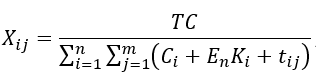
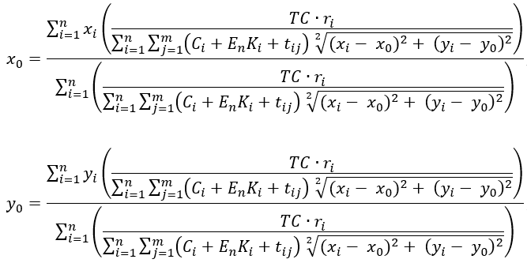
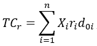

# best-enterprise-positioning-calculator

 [](https://github.com/everman32/best-enterprise-positioning-calculator/stargazers) [](https://github.com/everman32/best-enterprise-positioning-calculator/network) [](https://github.com/everman32/best-enterprise-positioning-calculator/issues) [](https://github.com/everman32/best-enterprise-positioning-calculator)

Mathematical apparatus for calculating the best positioning of an enterprise

## Installation
Use `npm` as a package manager. Install dependencies from `package.json`:
```bash
npm i
```

## Usage
To start the application, you must run `npm run start` or `npm run start:dev` to achive a hot reload:
```bash
npm start
```

The application calculates the optimal location of the distribution center in an import-export relationship involving suppliers and consumers. Positioning is performed using the centre of gravity method.

## Centre of gravity method
The centre of gravity method is typically used in operations management to determine the location of retail sites or, in most cases, to determine the strategic positioning points of wholesale warehouses.
The following indicators are important in the model:
* **Authorized capital (TC)** - is a set of monetary funds and property that are transferred by the founders in favor of the commercial organization,
* **Present costs (C<sub>i</sub>+E<sub>n</sub>K<sub>i</sub>+t<sub>ij</sub>)** - is the cost of unit production in *i*-th point and it's delivery to *j*-th point 
* **Product volume (X<sub>ij</sub>)**  - is the volume of supplies from the *i*-th production point to the *j*-th consumption point,
* **Transport tariff (r<sub>i</sub>)** - is the delivery tariff of *i*-th supplier/consumer per tonne-kilometer,
* **x<sub>i</sub>, y<sub>i</sub> coordinates** - are the location of *i*-th supplier/consumer,
* **x<sub>0</sub>, y<sub>0</sub> coordinates** - are the location of the distribution center at the previous iteration of the calculation.

***The formula for calculating the present costs is as follows:***



To solve the problem on location of one distribution center, an iterative convergent procedure of sequential calculation of coordinates of distribution center location was proposed, ending at the moment when additional reduction of transportation costs ceases to be practically significant.

***Below are the formulas for calculating the coordinates of the distribution center:***



***Below is the formula for calculating the moving costs that can be calculated with each iteration:***



* **d<sub>i0</sub>** - is the distance between the distribution center and the *i*-th supplier/consumer.

The number of iterations is determined by the requirements to the degree of accuracy of the obtained solution (**threshold**), i.e. it is necessary to repeat the steps until the total transportation costs cease to change by a significant amount.

## Example

### Get the optimal location of the distribution center:
```http
  Request:
  POST http://localhost:3000/api/enterprise/optimalPositioning

Headers
  Content-Type: application/json
  {
    "authorizedCapital": 2145,
    "threshold": 0.5,
    "customers": [
      {
        "coordinates": {
          "latitude": 0.94814,
          "longitude": 0.84712
        },
        "transportTariff": 2.1,
        "productVolume": 2194.6
      },
      {
        "coordinates": {
          "latitude": 0.57261,
          "longitude": 0.46281
        },
        "transportTariff": 0.421,
        "productVolume": 542.4
      }
    ]
  }
```
*Expect code **201** and distribution center location:*
```http
{
  "latitude": 0.94814,
  "longitude": 0.84712
}
```

## Contributing
Pull requests are welcome. For major changes, please open an issue first to discuss what you would like to change.

## License
[MIT](https://choosealicense.com/licenses/mit/)